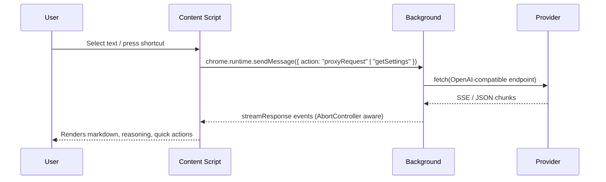

# 🚀 DeepSeekAI - Smart Web Assistant

<div align="center">


[](https://chromewebstore.google.com/detail/bjjobdlpgglckcmhgmmecijpfobmcpap)
[](LICENSE)
[](https://github.com/DeepLifeStudio/DeepSeekAI/stargazers)

[English](README.md) | [简体中文](README.zh-CN.md)

</div>

## 📖 Introduction

DeepSeekAI is an unofficial, open-source browser extension that lets you summon a private DeepSeek-powered co-pilot anywhere on the web. Highlight text, tap a quick action, or press a shortcut to open a floating chat workspace that streams answers, shows reasoning traces, and remembers your preferred layout. The project is independent from DeepSeek, and you must provide your own API key (DeepSeek or any OpenAI-compatible endpoint).

> **Note**: This extension is a community project and is not affiliated with DeepSeek. Keys, custom endpoints, and preferences are stored only in `chrome.storage.sync` on your device.

### 🔌 Supported API Providers
- [DeepSeek](https://deepseek.com) (official endpoint)
- [ByteDance Volcengine](https://www.volcengine.com/experience/ark?utm_term=202502dsinvite&ac=DSASUQY5&rc=OXTHJAF8)
- [SiliconFlow](https://cloud.siliconflow.cn/i/lStn36vH)
- [OpenRouter](https://openrouter.ai/models)
- [AiHubMix](https://aihubmix.com?aff=SmJB)
- [Tencent Cloud](https://cloud.tencent.com/document/product/1772/115969)
- [IFlytek Star](https://training.xfyun.cn/modelService)
- [Baidu Cloud](https://console.bce.baidu.com/qianfan/modelcenter/model/buildIn/list)
- [Aliyun](https://bailian.console.aliyun.com/#/model-market)
- Unlimited self-hosted/custom providers that expose an OpenAI-compatible `/chat/completions` endpoint

## ✨ Feature Overview

### 🪄 Inline Assistants
- Rich quick-action bubble appears beside any text selection with Chat, Copy, Translate (19 languages), Explain, Summarize, Email, and Analyze templates.
- SelectionPreservationManager keeps the DOM range alive so the bubble never steals your highlight during double/triple clicks or context-menu usage.
- Right-click context menu entry and toolbar popup both reuse the same flow, so highlighted text, manual prompts, and keyboard shortcuts share the session logic.

### 🪟 Floating Workspace
- `interactjs` gives the chat window magnetic drag + resize handles, snap animations, and a persistent minimize icon whose position is saved per user.
- Toggle "Remember window size" to keep the workspace dimensions across sites, and "Pin window" to prevent accidental closes when clicking outside.
- Minimized state, popup visibility, and icon location are tracked by `popupStateManager`, ensuring state survives selection changes.
- Built-in input container includes auto-expanding textarea, send icon, abort/stop square, and smart focus rules so existing form inputs retain priority.
- Each answer provides inline copy + regenerate controls; DeepSeek-R1/openrouter reasoning is rendered above the final response with a collapsible panel.
- Auto-scroll follows the stream until you scroll manually. Scroll momentum + cooldown logic prevent janky jumps.

### 🧠 Provider & Model Controls
- Popup UI (English/Chinese) manages API keys per provider, preferred language (auto-detect or force output), and whether the selection bubble is enabled.
- Add, rename, hide, or delete custom providers with their own base URL, display name, default model, and placeholder API-key links.
- ModelManager stores multiple custom models per provider. Dropdowns support inline delete buttons, and forms auto-save via TempStateManager so unfinished entries survive popup reloads.
- Configure a global custom system prompt used for every conversation, or override per quick action via templated prompts.

### 📝 Rendering, Safety & UX Polishing
- Markdown-It + highlight.js + KaTeX + DOMPurify ensure rich formatting, syntax highlighting, math rendering, and sanitized HTML.
- Code blocks gain reusable “Copy” controls, while each AI block also exposes regenerate + share-ready text copy actions.
- Streaming is proxied through the background service worker using modern `fetch` + `AbortController`, so stop/regenerate/shortcut commands instantly cut network traffic.
- ThemeManager listens to `prefers-color-scheme` and toggles CSS variables to keep the popover and quick buttons readable in both modes.

### ⌨️ Shortcuts & Invocation Options
- Two Chrome commands ship by default:
  - `Ctrl/Cmd + Shift + Y` → toggle chat (new session)
  - `Ctrl/Cmd + Shift + U` → show/hide chat (preserve session)
- Use `chrome://extensions/shortcuts` (or the “Shortcut Settings” link inside the popup) to rebind commands.
- Context menu entry (“DeepSeek AI”) sends the selected text directly, and the icon in the toolbar opens the configuration popup.

### 🔐 Privacy & Onboarding
- On first install we open [`src/Instructions/Instructions.html`](src/Instructions/instructions.html), an offline-friendly Apple-style guide covering every screen.
- `PRIVACY.html` documents exactly what is stored (API keys + user preferences in local browser storage) and reminds you that no remote server is involved.
- DOMPurify sanitizes all rendered HTML, and no telemetry or analytics is collected.

## 🔄 How It Works



- `content/content.js` glues together selection tracking, quick actions, the popup workspace, markdown renderer, theme watcher, scroll manager, and focus manager.
- `background.js` is the single network surface: it loads provider settings, streams responses, parses errors, handles aborts, manages commands/context menus, and opens onboarding tabs.
- `popup/` houses the modular settings UI (ApiKeyManager, ProviderManager, ModelManager, SystemPromptManager, etc.) with i18n + autosave.
- `Instructions/` exposes the offline guide viewed after installation.

## 🚀 Installation & Build

### 1. Install from the store (recommended)
- **Chrome**: [Chrome Web Store](https://chromewebstore.google.com/detail/bjjobdlpgglckcmhgmmecijpfobmcpap)
- **Microsoft Edge**: enable “Allow extensions from other stores,” then install via the same Chrome Web Store listing above.

### 2. Manual installation / development flow
```bash
# Requirements: Node.js 18+, pnpm (or npm), and a Chromium-based browser
pnpm install
pnpm run build   # outputs the production bundle into dist/
```

1. Open `chrome://extensions` → enable **Developer mode** → **Load unpacked** → pick the `dist` folder.
2. To ship a store package, run one of:
   - `pnpm run build:zip` → `extension.zip`
   - `pnpm run build:chrome` → `chrome-submission.zip`
   - `pnpm run build:edge` → `edge-submission.zip`
3. Upload the generated ZIP to the respective store dashboards.

## 🧩 Setup & Daily Use
1. Click the extension icon to open the popup.
2. Choose a provider (or create a custom one with a name + base URL + default model) and paste its API key. Each provider keeps its own key and optional custom API URL.
3. Pick or add a model. Non-DeepSeek providers require an explicit model ID; the UI will auto-prompt you to add one if missing.
4. Configure behavior:
   - Enable/disable the selection quick-action bubble.
   - Choose automatic language detection or force a language from the dropdown (20+ locales).
   - Toggle **Save Window Size**, **Pin Window**, and **Custom System Prompt**.
   - Use the **Shortcut Settings** link to jump to Chrome’s command editor.
5. Highlight text (or open the chat via shortcut) → the quick-action bubble appears → select Chat or a template. You can also open the floating window first and paste custom prompts.
6. While streaming, use the stop square icon to abort. Each answer ends with copy + regenerate icons; reasoning blocks collapse/expand with one click.
7. Need a refresher? Open the in-extension [usage guide](src/Instructions/instructions.html) or switch to the Simplified Chinese README linked at the top.

## ⌨️ Shortcuts & Quick Actions
- **Quick actions:**
  - `Chat` → sends selection verbatim.
  - `Copy` → copies selection without opening chat.
  - `Translate` → language picker drives a prompt that asks DeepSeek to translate into your chosen target language.
  - `Explain`, `Summarize`, `Email`, `Analyze` → curated prompts (with MBTI-flavored tone) for instant structured answers.
- **Window commands:** `toggle-chat` destroys and recreates the session; `show-hide-chat` keeps the current context alive between invocations; `close-chat` is exposed internally for context menu cleanup.
- **Context menu:** right-click → “DeepSeek AI” to push highlighted text directly into a new chat with a contextual greeting (morning/afternoon/evening).

## 🏗️ Project Layout & Stack
```
.
├── src/
│   ├── manifest.json           # MV3 metadata & permissions
│   ├── background.js           # service worker + proxy + commands
│   ├── content/                # selection bubble, popup workspace, services, utils, styles
│   ├── popup/                  # settings UI (managers, i18n, HTML)
│   └── Instructions/           # onboarding guide (HTML + JS)
├── dist/                       # build output (loaded during development/packaging)
├── extension.zip               # generated via build:zip / build:chrome / build:edge
├── webpack.config.js           # bundler config (Babel, CSS loader, copy plugin, terser)
├── PRIVACY.html                # privacy policy
└── README*.md                  # documentation (English + 简体中文)
```

**Key dependencies:** `interactjs`, `markdown-it`, `highlight.js`, `DOMPurify`, `katex`, `clipboard`, `perfect-scrollbar`, and `openai` (for payload typing) plus the MV3 APIs exposed by Chrome/Edge.

## 🔒 Privacy & Security
- API keys, preferences, quick-action states, and minimized icon positions live only inside `chrome.storage.sync`.
- Text is sent solely to the provider endpoint you configure. There are no intermediary servers, analytics calls, or remote logs.
- The offline [privacy policy](PRIVACY.html) inside the repo details data handling, and DOMPurify removes any potentially unsafe markup before rendering.

## 🤝 Contributing
Contributions are welcome—bug reports, documentation fixes, and feature proposals all help the community.

1. Fork the repo and create a branch (`git checkout -b feature/my-update`).
2. Install deps + build once (`pnpm install && pnpm run build`).
3. Make your changes, keep them focused, and run `pnpm run build` again to ensure `dist/` refreshes.
4. Submit a Pull Request describing the change, affected files, and any verification notes.

## 📄 License

This project is licensed under the MIT License - see [LICENSE](LICENSE) for details.

## 📮 Contact

- Issues: [GitHub Issues](https://github.com/DeepLifeStudio/DeepSeekAI/issues)
- Email: [1024jianghu@gmail.com](mailto:1024jianghu@gmail.com)
- Twitter/X: [@DeepLifeStudio](https://x.com/DeepLifeStudio)

<div align="center">
<h3>If this project helps you, please consider giving it a ⭐️</h3>
</div>
