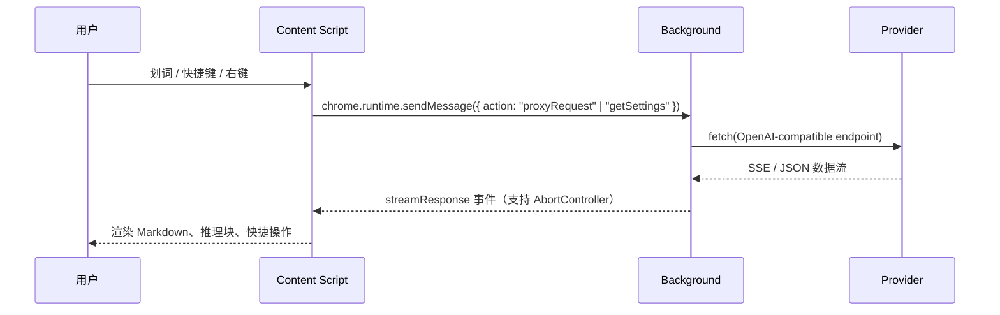

# 🚀 DeepSeekAI - 智能网页助手

<div align="center">


[](https://chromewebstore.google.com/detail/bjjobdlpgglckcmhgmmecijpfobmcpap)
[](LICENSE)
[](https://github.com/DeepLifeStudio/DeepSeekAI/stargazers)

[English](README.md) | [简体中文](README.zh-CN.md)

</div>

## 📖 简介

DeepSeekAI 是一个开源浏览器扩展，可以在任何网页上随时呼出私有的 DeepSeek 助手。只需划词、点击快捷操作或按下快捷键，即可打开一个浮动聊天工作区，实时流式展示回答、推理轨迹，并记住你偏好的布局。所有请求都需要你自行配置 API Key（DeepSeek 或任何兼容 OpenAI `/chat/completions` 规范的服务商）。

> **提示**：本扩展由社区维护。API Key、自定义 Endpoint 和偏好设置只会保存在你浏览器的 `chrome.storage.sync` 中。

### 🔌 支持的 API 服务商
- [DeepSeek](https://deepseek.com)（官方接口）
- [字节火山引擎 Volcengine](https://www.volcengine.com/experience/ark?utm_term=202502dsinvite&ac=DSASUQY5&rc=OXTHJAF8)
- [SiliconFlow](https://cloud.siliconflow.cn/i/lStn36vH)
- [OpenRouter](https://openrouter.ai/models)
- [AiHubMix](https://aihubmix.com?aff=SmJB)
- [腾讯云](https://cloud.tencent.com/document/product/1772/115969)
- [讯飞星辰](https://training.xfyun.cn/modelService)
- [百度智能云](https://console.bce.baidu.com/qianfan/modelcenter/model/buildIn/list)
- [阿里云](https://bailian.console.aliyun.com/#/model-market)
- 任何自建 / 自定义 OpenAI 兼容接口都可接入

## ✨ 功能速览

### 🪄 划词即用的轻量助手
- 划词后在文本旁生成快捷操作气泡：Chat、复制、翻译（19 种语言）、解释、总结、邮件、分析等模版一键可用。
- SelectionPreservationManager 持久化 DOM Range，确保双击/三击或右键菜单时选区不会丢失。
- 工具栏弹窗、右键菜单、快捷键全部复用同一套对话逻辑，选中内容与手动提问无缝切换。

### 🪟 漂浮式工作区
- 基于 `interactjs` 的拖拽/缩放体验，自带弹簧过渡动画与可记忆的最小化图标（持久化位置）。
- “记住窗口大小”和“固定窗口”开关可独立控制，防止误触关窗或在不同页面重复调整。
- `popupStateManager` 统一记录创建/显示/最小化状态，切换选区或键盘打开都能保持一致体验。
- 输入区包含自动扩展 textarea、发送箭头、停止按钮，并通过 focusManager 避免抢占当前页面输入焦点。
- 每条回答自带复制与重新生成按钮；DeepSeek-R1 / OpenRouter 的 reasoning 片段会出现在答案上方，可折叠查看。
- ScrollManager 管理滚动惯性与冷却时间，既能跟随流式输出，也能在手动滚动时保持视图稳定。

### 🧠 服务商与模型管理
- 弹窗 UI（中英双语）可为每个服务商分别存储 API Key、自定义 API 地址、默认语言与是否启用划词气泡。
- ProviderManager 支持新增、重命名、隐藏、删除自定义服务商，并自动填充获取 Key 的帮助链接。
- ModelManager 支持为任意服务商维护多模型列表（含 inline 删除按钮），表单内容由 TempStateManager 自动保存，防止弹窗刷新导致进度丢失。
- SystemPromptManager 允许配置全局自定义 System Prompt；Quick Action 模板也可覆盖局部提示词。

### 📝 渲染、安全与体验细节
- Markdown-It + highlight.js + KaTeX + DOMPurify 提供富文本、代码高亮、数学公式与 HTML 清洗能力。
- 代码块包裹通用复制按钮；回答块的复制/重生按钮与气泡一致，方便“整理后即复制”。
- 背景 Service Worker 通过现代 `fetch` + `AbortController` 代理所有请求，停止/重试/快捷键均可即时终止网络流。
- ThemeManager 监听 `prefers-color-scheme` 自动切换暗黑/浅色主题，气泡与工作区视觉统一。

### ⌨️ 唤起方式与快捷键
- 默认内置两个 Chrome Command：
  - `Ctrl/Cmd + Shift + Y` → Toggle chat（销毁并重建对话）
  - `Ctrl/Cmd + Shift + U` → Show/Hide chat（保留会话继续）
- 可通过 `chrome://extensions/shortcuts` 或弹窗内「快捷键设置」链接重新绑定。
- 右键菜单「DeepSeek AI」会带上当前选中内容，并附加早/午/晚问候语。

### 🔐 隐私与新手引导
- 首次安装会自动打开 [Instructions/Instructions.html](src/Instructions/instructions.html)，内置离线教程，UI 采用 Apple 风格，覆盖所有界面和操作。
- 仓库中附带 [PRIVACY.html](PRIVACY.html)，明确说明所有数据仅存在浏览器本地，不上传到任何服务器。
- DOMPurify 负责清洗渲染内容，全流程无遥测、无埋点、无第三方统计。

## 🔄 工作原理



- `src/content/content.js` 负责划词气泡、工作区、Markdown 渲染、主题/滚动/焦点管理等全部前端交互。
- `src/background.js` 负责读取设置、转发网络请求、处理 SSE、命令与右键菜单、Onboarding 页面等。
- `src/popup/` 是模块化设置面板（ApiKeyManager、ProviderManager、ModelManager、SystemPromptManager...）并内置 i18n 与自动保存。
- `src/Instructions/` 存放首次安装时展示的离线说明。

## 🚀 安装与构建

### 1. 应用商店安装（推荐）
- **Chrome**： [Chrome Web Store](https://chromewebstore.google.com/detail/bjjobdlpgglckcmhgmmecijpfobmcpap)
- **Microsoft Edge**：开启 “Allow extensions from other stores” 后，可直接使用同一 Chrome 商店链接。

### 2. 手动安装 / 开发流程
```bash
# 依赖：Node.js 18+、pnpm（或 npm）、Chromium 内核浏览器
pnpm install
pnpm run build   # 产出 dist/ 目录
```

1. 打开 `chrome://extensions` → 开启 **开发者模式** → **加载已解压的扩展程序** → 选择 `dist` 文件夹。
2. 需要打包商店版本时可运行：
   - `pnpm run build:zip` → 生成 `extension.zip`
   - `pnpm run build:chrome` → 生成 `chrome-submission.zip`
   - `pnpm run build:edge` → 生成 `edge-submission.zip`
3. 将对应 ZIP 上传至各自商店控制台即可提交审核。

## 🧩 配置与日常使用
1. 点击浏览器扩展图标打开弹窗。
2. 选择服务商（或新建自定义服务商，填写名称 + 基础 URL + 默认模型）并输入对应 API Key。各服务商的 Key、API 地址互不干扰。
3. 选择或创建模型。非 DeepSeek 服务商必须显式填写模型 ID；若缺失，UI 会提醒并自动弹出添加模型对话框。
4. 配置行为：
   - 开关划词快捷操作。
   - 选择自动识别语言或强制输出语言（内置 20+ 语言）。
   - 切换 “记住窗口大小”、“固定窗口” 以及 “自定义 System Prompt”。
   - 通过 **Shortcut Settings** 跳转至 Chrome 快捷键编辑器。
5. 划词（或直接打开聊天窗口）→ 快捷操作气泡出现 → 选择 Chat/模版即可。不划词也可以先打开工作区再粘贴内容提问。
6. 流式生成过程中可点击停止按钮中断；回答末尾提供复制与重生按钮，Reasoning 区域支持折叠/展开。
7. 需要复习？可随时打开扩展内的 [离线指南](src/Instructions/instructions.html) 或切换到顶部链接的英文版 README。

## ⌨️ 快捷操作与命令
- **快捷操作内容**：
  - `Chat` → 直接发送当前选区。
  - `Copy` → 不唤出聊天，仅复制选中文本。
  - `Translate` → 弹出语言列表，驱动 DeepSeek 翻译到目标语言。
  - `Explain` / `Summarize` / `Email` / `Analyze` → 内置模板（含 MBTI 风格）的结构化回答。
- **窗口命令**：`toggle-chat` 重新创建新会话；`show-hide-chat` 保留上下文；`close-chat` 在内部用于上下文菜单清理。
- **右键菜单**：右键选择 “DeepSeek AI” 即可把选区连同问候语发送到新对话。

## 🏗️ 项目结构与技术栈
```
.
├── src/
│   ├── manifest.json           # MV3 元数据与权限
│   ├── background.js           # Service Worker + 代理 + 快捷命令
│   ├── content/                # 划词气泡、工作区、服务、工具、样式
│   ├── popup/                  # 设置 UI（各管理器、i18n、HTML）
│   └── Instructions/           # 首次安装展示的离线说明
├── dist/                       # 构建产物
├── extension.zip               # build:zip/build:chrome/build:edge 产物
├── webpack.config.js           # 构建配置（Babel、CSS Loader、Copy、Terser）
├── PRIVACY.html                # 隐私政策
└── README*.md                  # 中英文文档
```

**核心依赖**：`interactjs`、`markdown-it`、`highlight.js`、`DOMPurify`、`katex`、`clipboard`、`perfect-scrollbar`、`openai`（用于请求结构）以及 Chrome/Edge 的 MV3 API。

## 🔒 隐私与安全
- API Key、偏好设置、快捷操作状态、最小化图标位置全部保存在 `chrome.storage.sync`，不会离开本地。
- 文本仅发送至你配置的服务商 Endpoint，无中转服务器、无日志、无埋点。
- 仓库内的 [PRIVACY.html](PRIVACY.html) 记录全部细节，DOMPurify 负责渲染前的安全清洗。

## 🤝 贡献指南
欢迎提交 Bug 报告、文档修正或新功能提案：

1. Fork 仓库并创建分支（`git checkout -b feature/my-update`）。
2. 安装依赖并构建一次（`pnpm install && pnpm run build`）。
3. 保持改动聚焦，修改完成后再次 `pnpm run build`，确保 `dist/` 更新。
4. 发起 Pull Request，描述改动、涉及文件与验证方式。

## 📄 许可证

本项目遵循 MIT 许可证，详见 [LICENSE](LICENSE)。

## 📮 联系方式

- Issues： [GitHub Issues](https://github.com/DeepLifeStudio/DeepSeekAI/issues)
- Email： [1024jianghu@gmail.com](mailto:1024jianghu@gmail.com)
- Twitter/X： [@DeepLifeStudio](https://x.com/DeepLifeStudio)

<div align="center">
<h3>如果这个项目对你有帮助，请顺手点一个 ⭐️</h3>
</div>
